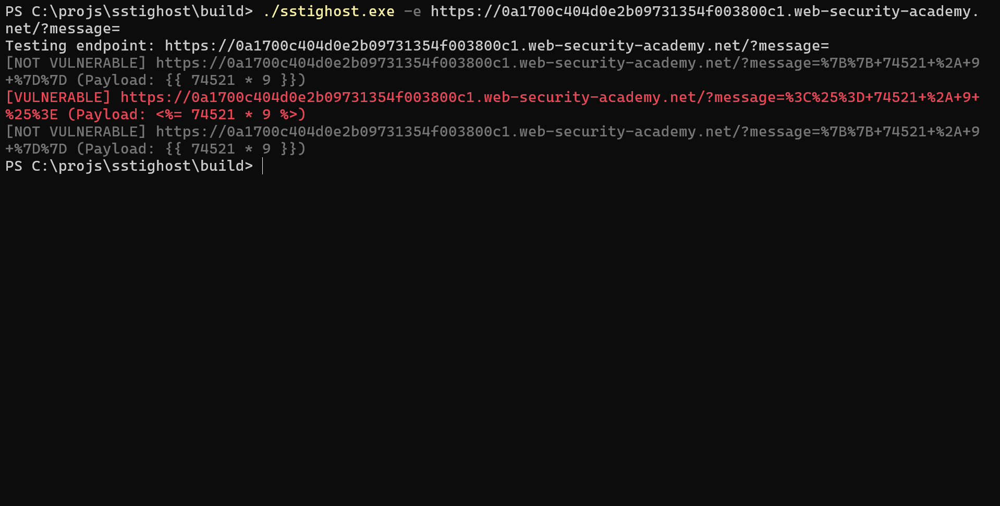

# SSTIGHOST - AN SSTI SCANNER DEVELOPED IN GOLANG.


[My Services And Contact](https://eikehacker1.github.io/eikeoliveira/)

<span style="color: red;">Warning: The calculation value is 670689, make sure this value is not previously on the page.</span>
### Technologies he explores

   

## Use download to download the version compatible with your operating system.

``` bash
curl -L "https://raw.githubusercontent.com/eikehacker1/xssghost/build/sstighost_mac" -o "sstighost_mac" #MACOS intel-chip

curl -L "https://raw.githubusercontent.com/eikehacker1/xssghost/build/sstighost_macm1" -o "sstighost_macm1" #MACOS  m1-chip

curl -L "https://raw.githubusercontent.com/eikehacker1/xssghost/build/sstighost.exe" -o "sstighost.exe" #WindowsX64 

curl -L "https://raw.githubusercontent.com/eikehacker1/xssghost/build/sstighost_linux" -o "sstighost_linux" #LinuxX64

```
## Install using go install
```bash
go install -v github.com/eikehacker1/sstighost@v0.1.2
```
# HOW TO USE:

### brute use 
```bash 
./sstighost.exe https://example.com/
```

### Only results 

``` bash
./sstighost.exe -only-poc https://example.com/
```
### Test a specific endpoint

```bash
./sstighost.exe -e https://example.com/?s= 
```
### Output 


### Help + More Options
```text
./sstighost.exe -h
Usage of ./sstighost.exe:
  -a    Append the value instead of replacing it
  -c int
        Set concurrency (default 50)
  -dates
        Show date of fetch in the first column
  -e string
        Endpoint to test for SSTI vulnerabilities
  -get-versions
        List URLs for crawled versions of input URL(s)
  -headers value
        Custom headers
  -ignore-path
        Ignore the path when considering what constitutes a duplicate
  -no-subs
        Don't include subdomains of the target domain
  -only-poc
        Show only potentially vulnerable URLs
  -proxy string
        Send traffic to a proxy (default "0")

```
